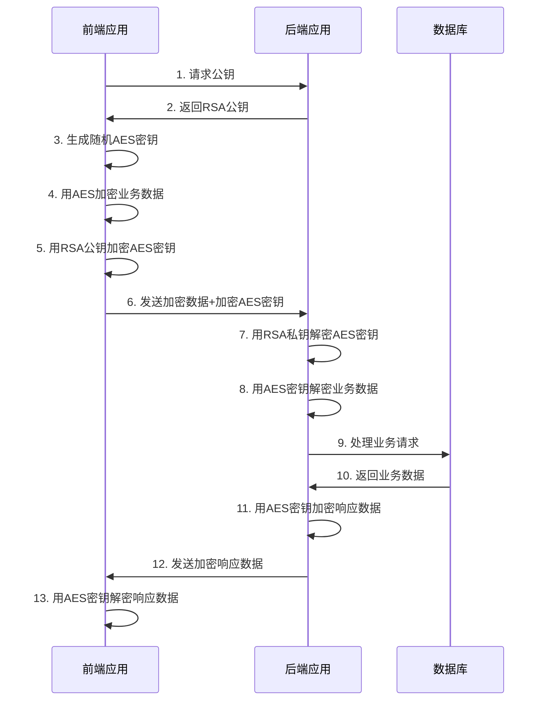

# 前后端接口加密传输技术方案设计

## 1. 架构设计

### 1.1 整体架构

采用混合加密方案（RSA + AES）实现前后端接口数据加密传输，整体架构如下：



### 1.2 核心组件

- **加密工具类**：提供AES和RSA加密解密的核心功能
- **拦截器**：处理请求和响应的加密解密
- **密钥管理服务**：负责RSA密钥对的生成、存储和管理
- **前端加密SDK**：提供前端加密解密的工具方法

## 2. 技术选型

- **后端框架**：Spring Boot 3.3.5
- **加密算法**：
  - RSA：非对称加密，用于加密AES密钥
  - AES：对称加密，用于加密业务数据
- **密钥长度**：
  - RSA：2048位
  - AES：256位
- **数据格式**：JSON
- **传输协议**：HTTPS

## 3. 接口设计

### 3.1 获取公钥接口

- **接口路径**：`/api/encryption/public-key`
- **请求方法**：GET
- **请求参数**：无
- **响应数据**：
  ```json
  {
    "code": 200,
    "message": "success",
    "data": {
      "publicKey": "BASE64编码的RSA公钥"
    }
  }
  ```

### 3.2 加密数据传输接口

所有需要加密传输的接口应遵循以下规范：

- **请求头**：
  - `Content-Type`: `application/json`
  - `X-Encryption-Type`: `RSA-AES` (标识使用混合加密方案)
  - `X-AES-Key`: BASE64编码的RSA加密后的AES密钥
- **请求体**：BASE64编码的AES加密后的业务数据
- **响应体**：BASE64编码的AES加密后的业务响应数据

## 4. 后端实现方案

### 4.1 核心加密工具类

```java
public class EncryptionUtils {
    // AES加密解密方法
    public static String aesEncrypt(String data, String key) { /* 实现 */ }
    public static String aesDecrypt(String encryptedData, String key) { /* 实现 */ }
    
    // RSA加密解密方法
    public static String rsaEncrypt(String data, String publicKey) { /* 实现 */ }
    public static String rsaDecrypt(String encryptedData, String privateKey) { /* 实现 */ }
    
    // 生成RSA密钥对
    public static KeyPair generateRsaKeyPair() { /* 实现 */ }
    
    // 生成随机AES密钥
    public static String generateAesKey() { /* 实现 */ }
}
```

### 4.2 拦截器实现

创建`EncryptionInterceptor`实现`HandlerInterceptor`接口，用于处理请求和响应的加密解密：

```java
public class EncryptionInterceptor implements HandlerInterceptor {
    @Autowired
    private KeyManagerService keyManagerService;
    
    @Override
    public boolean preHandle(HttpServletRequest request, HttpServletResponse response, Object handler) {
        // 判断是否需要加密处理
        if (isEncryptionRequired(request)) {
            // 从请求头获取加密的AES密钥
            String encryptedAesKey = request.getHeader("X-AES-Key");
            // 用RSA私钥解密获取AES密钥
            String aesKey = keyManagerService.decryptAesKey(encryptedAesKey);
            // 解密请求体数据
            String decryptedData = EncryptionUtils.aesDecrypt(getRequestBody(request), aesKey);
            // 替换请求体
            replaceRequestBody(request, decryptedData);
        }
        return true;
    }
    
    @Override
    public void postHandle(HttpServletRequest request, HttpServletResponse response, Object handler, ModelAndView modelAndView) {
        // 在响应返回前进行加密处理
    }
}
```

### 4.3 密钥管理服务

```java
@Service
public class KeyManagerService {
    private KeyPair rsaKeyPair;
    
    @PostConstruct
    public void init() {
        // 初始化RSA密钥对
        this.rsaKeyPair = loadOrGenerateKeyPair();
    }
    
    public String getPublicKey() {
        // 返回BASE64编码的RSA公钥
        return encodePublicKey(rsaKeyPair.getPublic());
    }
    
    public String decryptAesKey(String encryptedAesKey) {
        // 用RSA私钥解密AES密钥
        return EncryptionUtils.rsaDecrypt(encryptedAesKey, getPrivateKeyString());
    }
    
    private KeyPair loadOrGenerateKeyPair() {
        // 从安全位置加载密钥对，如果不存在则生成新的密钥对
    }
}
```

## 5. 前端实现方案

### 5.1 前端加密工具

```javascript
class EncryptionClient {
    constructor() {
        this.publicKey = null;
        this.aesKey = null;
    }
    
    async init() {
        // 获取RSA公钥
        const response = await fetch('/api/encryption/public-key');
        const data = await response.json();
        this.publicKey = data.data.publicKey;
    }
    
    encryptData(data) {
        // 生成随机AES密钥
        this.aesKey = this.generateAesKey();
        // 加密业务数据
        const encryptedData = this.aesEncrypt(JSON.stringify(data), this.aesKey);
        // 加密AES密钥
        const encryptedAesKey = this.rsaEncrypt(this.aesKey, this.publicKey);
        
        return {
            encryptedData: encryptedData,
            encryptedAesKey: encryptedAesKey
        };
    }
    
    decryptData(encryptedData) {
        // 解密数据
        const decryptedData = this.aesDecrypt(encryptedData, this.aesKey);
        return JSON.parse(decryptedData);
    }
    
    generateAesKey() { /* 实现 */ }
    aesEncrypt(data, key) { /* 实现 */ }
    aesDecrypt(encryptedData, key) { /* 实现 */ }
    rsaEncrypt(data, publicKey) { /* 实现 */ }
}
```

### 5.2 API请求封装

```javascript
async function sendEncryptedRequest(url, method, data) {
    // 初始化加密客户端
    const encryptionClient = new EncryptionClient();
    await encryptionClient.init();
    
    // 加密数据
    const encrypted = encryptionClient.encryptData(data);
    
    // 发送请求
    const response = await fetch(url, {
        method: method,
        headers: {
            'Content-Type': 'application/json',
            'X-Encryption-Type': 'RSA-AES',
            'X-AES-Key': encrypted.encryptedAesKey
        },
        body: encrypted.encryptedData
    });
    
    // 解密响应
    const encryptedResponse = await response.text();
    const decryptedResponse = encryptionClient.decryptData(encryptedResponse);
    
    return decryptedResponse;
}
```

## 6. 安全性考虑

1. **密钥保护**：RSA私钥必须存储在安全的位置，建议使用密钥管理服务或环境变量
2. **HTTPS保障**：所有通信必须使用HTTPS，加密传输作为额外的安全层
3. **防重放攻击**：可以在请求中添加时间戳和随机数，防止重放攻击
4. **密钥轮换**：定期轮换RSA密钥对，提高安全性
5. **敏感信息处理**：对于特别敏感的信息，考虑在前端进行脱敏处理

## 7. 性能优化

1. **AES密钥缓存**：前端可以缓存AES密钥，避免每次请求都生成新的密钥
2. **公钥缓存**：前端缓存RSA公钥，减少获取公钥的请求
3. **异步处理**：加密解密操作应使用异步方式，避免阻塞主线程
4. **批量处理**：对于大量数据，考虑批量加密处理

## 8. 测试策略

1. **单元测试**：测试加密解密算法的正确性
2. **集成测试**：测试前后端加密传输的整个流程
3. **性能测试**：测试加密传输对系统性能的影响
4. **安全测试**：测试加密方案的安全性，包括密钥泄露、中间人攻击等场景